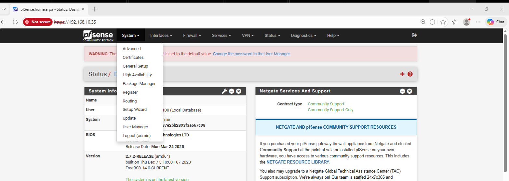

# SOC System - IPS / IDS / WAF

# System Components

- **pfSense + IPS**: firewall, NAT, network traffic monitoring, IPS rules
- **WAF (DMZ)**: web application protection, filter malicious HTTP/HTTPS requests
- **Web Server**: host internal websites and web applications
- **Database Server**: store application data
- **IDS Server**: monitor internal traffic, detect intrusions
- **ELK Stack**: collect, centralize, and analyze logs from all devices and services

# Data Flow

- External traffic goes through **pfSense + IPS** for filtering and monitoring
- HTTP/HTTPS requests are NATed to **WAF** in the DMZ
- WAF filters malicious requests and forwards clean traffic to the **Web Server**
- **IDS Server** monitors internal traffic and detects abnormal behavior
- All logs from firewall, WAF, Web Server, Database, and IDS are sent to **ELK Stack** for analysis

# Network Diagram

Below is the overall network diagram of the project

From the diagram, the main devices/components include: pfSense + IPS (primary/backup), WAF, Web Server, Database, IDS Server, ELK (SIEM), together with WAN/LAN/DMZ zones.

After understanding the diagram, below is the VMware Virtual Network (VMnet) configuration and virtual subnets used in this lab.

This is the network configuration file for anyone interested, which can be used to import and build exactly as in the diagram: [SOC NETWORK LAB](../files/SOC_NETWORK)

## Network Subnet Design

- **WAN Subnet:** `192.168.75.0/24`
  - Gateway: `192.168.75.2`
  - Purpose: Internet connection / upstream router

- **LAN Subnet:** `192.168.10.0/24`
  - Gateway: `192.168.10.1`
  - Purpose: internal network for users and management machines

- **DMZ Subnet:** `192.168.20.0/24`
  - Gateway: `192.168.20.1`
  - Purpose: contains WAF

- **DMZ_WEB Subnet:** `192.168.30.0/24`
  - Gateway: `192.168.30.1`
  - Purpose: contains Web Server, IDS Server, Database

  - **SEC-ZONE Subnet:** `192.168.40.0/24`
  - Gateway: `192.168.40.1`
  - Purpose: contains ELK

## Static IP Assignment

- pfSense Firewall:
  - WAN : `192.168.75.131`

  - LAN : `192.168.10.10`

- pfSense Firewall (Backup):
  - WAN : `192.168.75.135`

  - LAN : `192.168.75.20`

- ELK Stack: `192.168.40.60`
- **IDS Server:**
  - **NIC 1:** No IP address is configured. This NIC is used in **sniffing/monitoring** mode to monitor traffic in the **DMZ_WEB** network zone.
  - **NIC 2:** `192.168.40.50` - Used to send logs and alerts to **ELK Stack** for event aggregation, analysis, and monitoring.
- Kali Linux: `192.168.75.10`
- DVWA Web Server: `192.168.20.30`
- Reverse Proxy / WAF: `192.168.30.40`

# PFSENSE Installation

Here, pfSense version 2.7.2 CE will be installed, then updated to the latest version to reduce complexity.

- Download link: [pfSense 2.7.2 CE](https://repo.ialab.dsu.edu/pfsense/pfSense-CE-2.7.2-RELEASE-amd64.iso.gz)

After installation, go to VMware to proceed with pfSense setup

At this step, click **Customize Hardware** to change pfSense settings

- **Set the parameters as follows:**

## Set the parameters as follows:

| Component             | Configuration                            |
| --------------------- | ---------------------------------------- |
| **RAM**               | `2GB` or `4GB` (depending on host specs) |
| **Processor**         | `Number of processors: 2`                |
| **Network Adapter 1** | `NAT`                                    |
| **Network Adapter 2** | `Custom (VMnet1)`                        |
| **Network Adapter 3** | `Custom (VMnet2)`                        |
| **Network Adapter 4** | `Custom (VMnet3)`                        |
| **Network Adapter 5** | `Custom (VMnet4)`                        |
| **Network Adapter 6** | `Custom (VMnet5)`                        |

Then click **OK** and **Finish** to continue pfSense installation. In pfSense setup UI, select in order: **Accept** -> **OK** -> **OK** -> **Select** -> **OK**, then the following screen appears:

At this point, press Space to select, then **OK**, **Yes**, and **Reboot** to continue

Configure LAN IP to access pfSense

- Select 2 - **Assign Interfaces**

- Select 2 - **LAN (em1 - static)**

- In this case, `em1` corresponds to `VMnet1`.
- First, enter the LAN IP you want to assign. Example here: `192.168.10.35`
- For Enter a new LAN IPv4 Subnet, set `24`

- At this step, perform in order: press `Enter`, type `n`, press `Enter` again, then type `n` to complete configuration.

# Note

- To access pfSense GUI, the client machine must have an IP in the **same subnet / same network range** as pfSense LAN IP.

After finishing installation and LAN IP configuration for pfSense, access the management GUI via the configured LAN IP from previous step.

> GUI address used in this lab: `https://192.168.10.35`

Default pfSense username/password: `admin / pfsense`

After successful login, the first step is initial setup via **Setup Wizard**.

- At this step, set hostname as desired. In this lab, default is `pfSense`
- Primary DNS Server : 8.8.8.8 (or leave empty)
- Secondary DNS Server : 8.8.4.4 (or leave empty)

- Continue **Next** to this step, select TimeZone as `Asia/Ho_Chi_Minh`
  and continue by clicking **Next**

- At this step, uncheck these 2 options: `Block private networks from entering via WAN` and `Block non-Internet routed networks from entering via WAN`

- Click **Next** to this step, enter new password for pfSense access. In this lab, keep old password `pfsense`

- Wait around 15s - 20s

- Click **Next** to enter pfSense Dashboard

## Update pfSense to the latest version

To make the lab run smoothly, pfSense should be updated to the latest version to avoid potential issues. Below are the update steps.

- Select `System` -> `Update`

- In `Update`, click `Branch` and select `Current Stable Version (2.8.1)` (currently latest at the time of this lab)

- If error `Unable to check for updates` appears, follow these steps:

- Select `Diagnostics` -> `Command Prompt` and paste the following commands into `Execute Shell Command`

| Step  | Command                                                   |
| ----- | --------------------------------------------------------- |
| **1** | `certctl rehash`                                          |
| **2** | `pkg-static update`                                       |
| **3** | `pkg-static install -fy pkg pfSense-repo pfSense-upgrade` |

- After running the commands above, go back and continue pfSense update.
- Click `Confirm` to update pfSense

- After the update process completes, pfSense will reboot automatically. After reboot, verify pfSense version again to confirm update success.

- Set up basic **Firewall Rules** by interface
- NAT / Port Forward for Web Server and DVWA services
- Configure IPS to detect and block intrusions

# Web Service Deployment

## Windows Server + IIS

- Set static IP in DMZ
- Install IIS 10 and deploy sample site
- Test access from LAN, DMZ, and WAN

## Ubuntu + DVWA / Docker

- Set static IP in DMZ
- Install Docker and run DVWA container
- Test web access from LAN, DMZ, WAN

# SOC Deployment

- Install SOC tools (ELK, Wazuh, Graylog...)
- Collect logs from pfSense, WAF, Web Server, Database, IDS
- Configure dashboards and alerts based on security rules
- Monitor network status and incidents in real-time

# IPS / IDS Setup

- Install Snort or Suricata
- Configure basic rules to detect network intrusions, malware, exploit
- Integrate with SOC to send alerts and centralized logs

# WAF Deployment

- Install ModSecurity or a WAF compatible with IIS / Web Server
- Configure policies to protect web endpoints
- Test effectiveness of malicious request filtering

# High Availability (HA)

- Configure **pfSense HA** with CARP VIP to ensure firewall failover
- Backup and failover for critical servers
- Test service availability in failure scenarios

# Test & Evaluation

- Ping test from LAN/DMZ -> WAN
- Access web services from WAN
- Verify SOC / IPS / IDS / WAF alerts
- Evaluate HA failover and service availability

# Under Preparation

> Information and content are being updated, more will be added as soon as possible
