# SOC System - IPS / IDS / WAF

# System Components

- **pfSense + IPS**: firewall, NAT, network traffic monitoring, IPS rules
- **WAF (DMZ)**: protects web applications, filters malicious HTTP/HTTPS requests
- **Web Server**: hosts internal websites and web applications
- **Database Server**: stores application data
- **IDS Server**: monitors internal traffic, detects intrusions
- **ELK Stack**: collects, centralizes, and analyzes logs from all devices and services

# Data Flow

- External traffic passes through **pfSense + IPS** for filtering and monitoring
- HTTP/HTTPS requests are NATed to the **WAF** in the DMZ
- WAF filters malicious requests and forwards clean traffic to the **Web Server**
- **IDS Server** monitors internal traffic and detects abnormal behavior
- All logs from firewall, WAF, Web Server, Database, and IDS are sent to the **ELK Stack** for analysis

# Network Diagram

Below is the high-level network diagram of the project.

From the diagram, you can see the main devices/components: pfSense + IPS (primary/backup), WAF, Web Server, Database, IDS Server, ELK (SIEM), and WAN/LAN/DMZ zones.

After understanding the diagram, below is the VMware Virtual Network (VMnet) configuration and virtual subnets used in this lab.

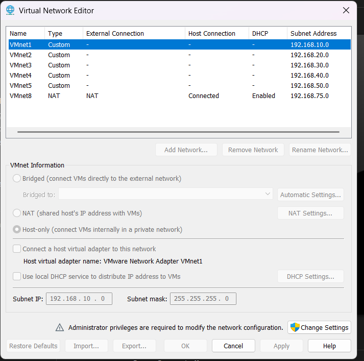

This is the network configuration file for anyone interested. You can use it to import and build the same topology shown above: [SOC NETWORK LAB](../files)

## Network Subnet Design

- **WAN Subnet:** `192.168.75.0/24`
  - Gateway: `192.168.75.2`
  - Purpose: Internet connection / upstream router

- **LAN Subnet:** `192.168.10.0/24`
  - Gateway: `192.168.10.1`
  - Purpose: internal network for users and management machines

- **DMZ Subnet:** `192.168.20.0/24`
  - Gateway: `192.168.20.1`
  - Purpose: contains WAF

- **DMZ_WEB Subnet:** `192.168.30.0/24`
  - Gateway: `192.168.30.1`
  - Purpose: contains Web Server, IDS Server, Database

- **SEC-ZONE Subnet:** `192.168.40.0/24`
  - Gateway: `192.168.40.1`
  - Purpose: contains ELK

## Static IP Assignment

- pfSense Firewall:
  - WAN : `192.168.75.131`

  - LAN : `192.168.10.10`

- pfSense Firewall (Backup):
  - WAN : `192.168.75.135`

  - LAN : `192.168.75.20`

- ELK Stack: `192.168.40.60`
- **IDS Server:**
  - **NIC 1:** No IP address configured. This NIC is used in **sniffing/monitoring** mode to monitor traffic in the **DMZ_WEB** network zone.
  - **NIC 2:** `192.168.40.50` - Used to send logs and alerts to the **ELK Stack** for event aggregation, analysis, and monitoring.
- Kali Linux: `192.168.75.10`
- DVWA Web Server: `192.168.20.30`
- Reverse Proxy / WAF: `192.168.30.40`

# Install pfSense

Here, pfSense version 2.7.2 CE will be installed first, then upgraded to the latest version to reduce complexity.

- Download link: [pfSense 2.7.2 CE](https://repo.ialab.dsu.edu/pfsense/pfSense-CE-2.7.2-RELEASE-amd64.iso.gz)

After installation, open VMware to proceed with pfSense setup.

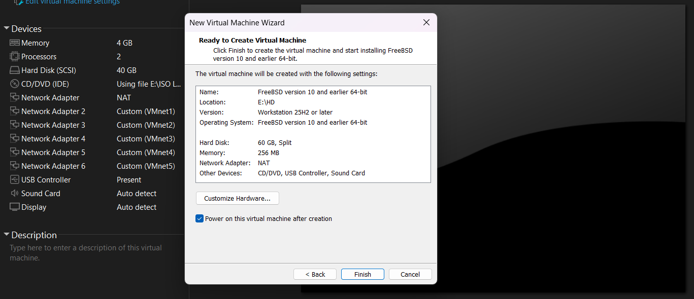

At this step, click **Customize Hardware** to change pfSense settings.

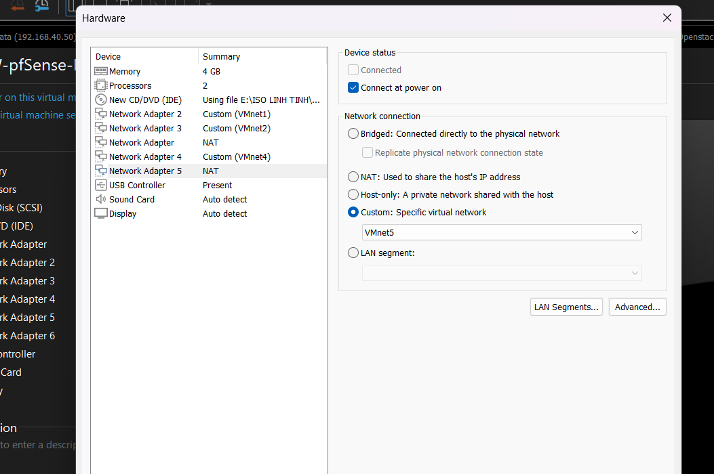

## Set the following parameters:

| Component             | Configuration                            |
| --------------------- | ---------------------------------------- |
| **RAM**               | `2GB` or `4GB` (depending on host specs) |
| **Processor**         | `Number of processors: 2`                |
| **Network Adapter 1** | `NAT`                                    |
| **Network Adapter 2** | `Custom (VMnet1)`                        |
| **Network Adapter 3** | `Custom (VMnet2)`                        |
| **Network Adapter 4** | `Custom (VMnet3)`                        |
| **Network Adapter 5** | `Custom (VMnet4)`                        |
| **Network Adapter 6** | `Custom (VMnet5)`                        |

Then click **OK** and **Finish** to continue pfSense installation. In the pfSense installer, select in order: **Accept** -> **OK** -> **OK** -> **Select** -> **OK**. The following screen will appear:

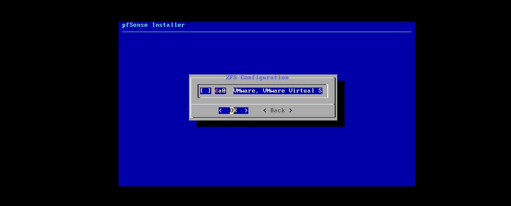

At this point, press Space to select, then **OK**, **Yes**, and **Reboot** to continue.

Configure a LAN IP address to access pfSense.

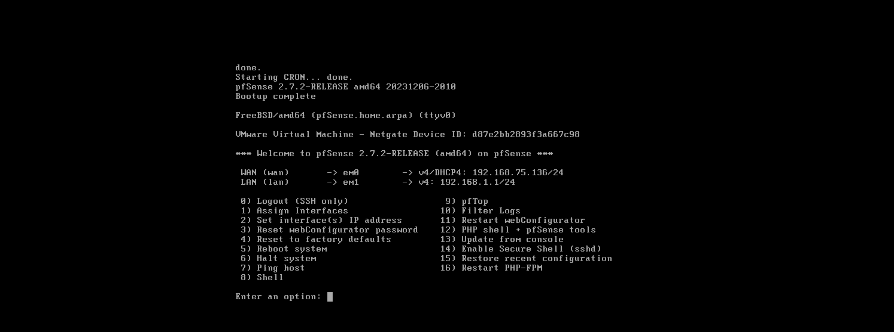

- Select 2 - **Assign Interfaces**

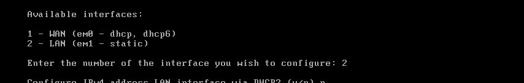

- Select 2 - **LAN (em1 - static)**

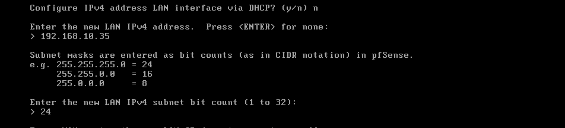

- In this case, `em1` corresponds to `VMnet1`.
- First, enter the LAN IP you want to assign. Example here: `192.168.10.35`
- For Enter a new LAN IPv4 Subnet, set `24`.

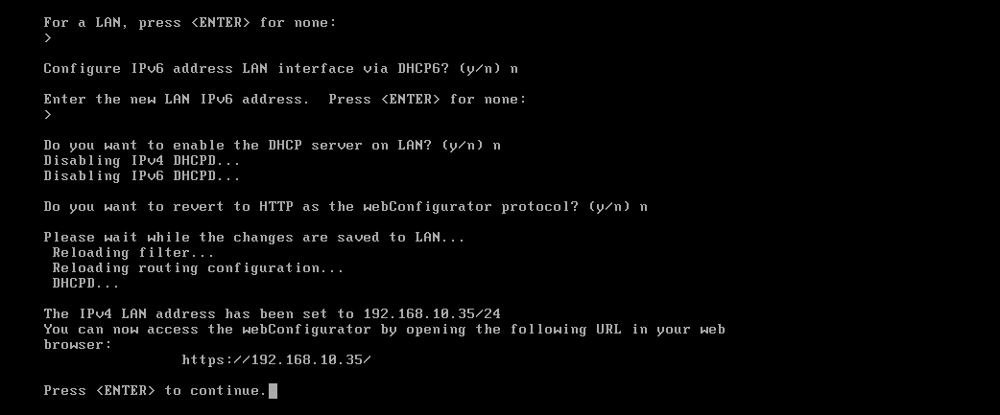

- At this step, perform in order: press `Enter`, type `n`, press `Enter` again, then type `n` to complete configuration.

# Notes

- To access the pfSense GUI, the client machine must be configured with an IP in the **same subnet / same network range** as pfSense LAN IP.

After completing installation and LAN IP configuration, access the pfSense management GUI via the LAN IP configured in the previous step.

> The pfSense GUI address in this lab is: `https://192.168.10.35`

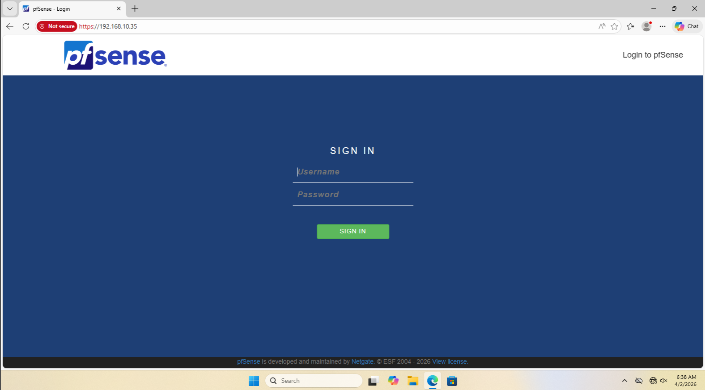

Default pfSense username and password: `admin / pfsense`

After logging in successfully, the first step is initial setup via **Setup Wizard**.

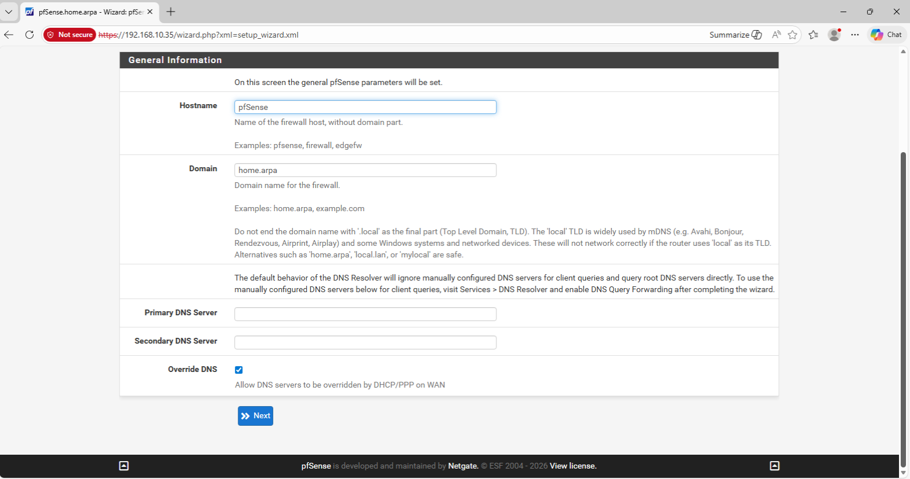

- At this step, set hostname as desired. In this lab, keep the default `pfSense`
- Primary DNS Server: `8.8.8.8` (or leave empty)
- Secondary DNS Server: `8.8.4.4` (or leave empty)

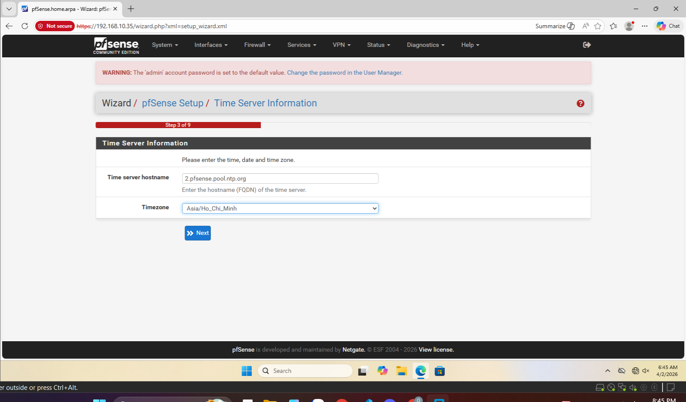

- Continue with **Next**. At this step, set TimeZone to `Asia/Ho_Chi_Minh`, then click **Next**.

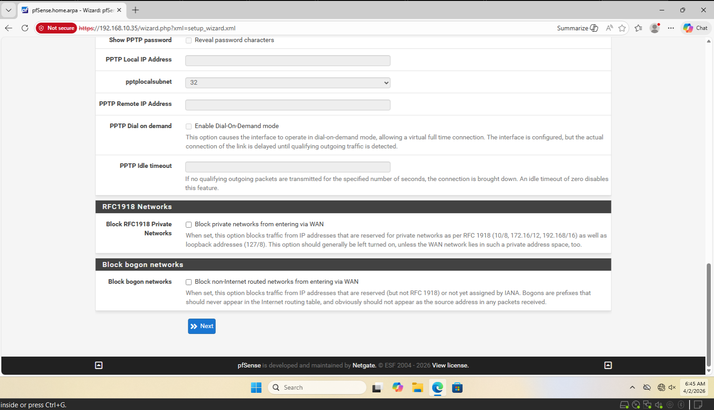

- At this step, uncheck these two options: `Block private networks from entering via WAN` and `Block non-Internet routed networks from entering via WAN`.

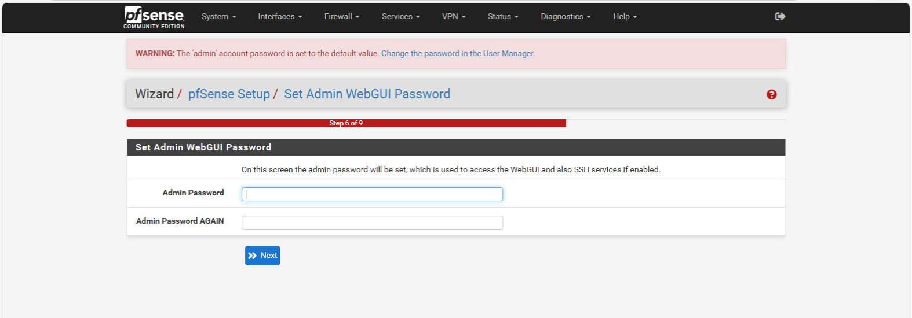

- Click **Next**. At this step, enter a new password for pfSense access. In this lab, keep the old password `pfsense`.

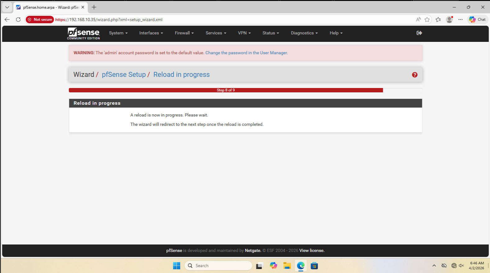

- Wait around 15s - 20s.

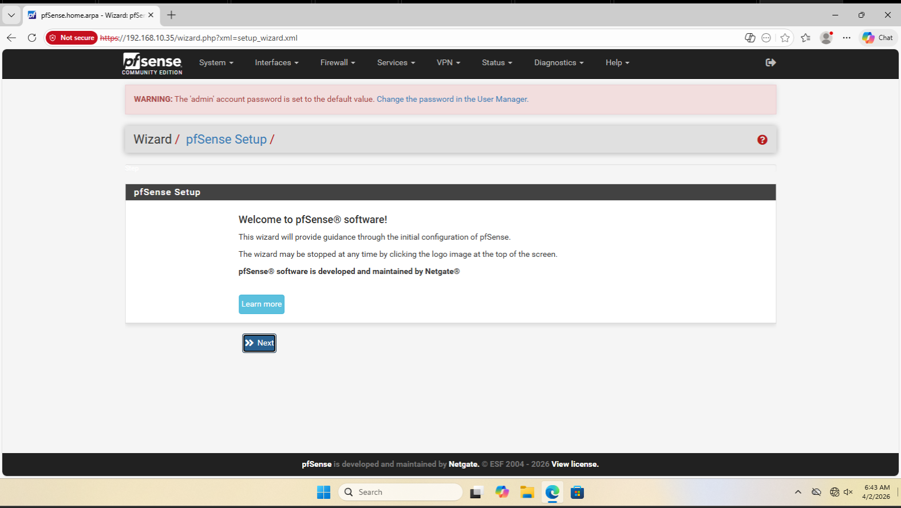

- Click **Next** to enter the pfSense Dashboard.

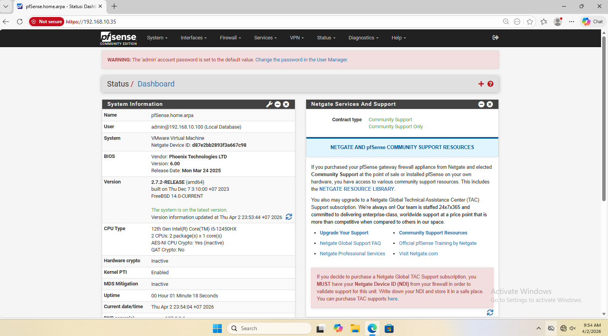

## Update pfSense to the latest version

To make the lab run smoothly, update pfSense to the latest version to avoid issues during the lab. The steps are below.

- Select `System` -> `Update`

- In `Update`, click `Branch` and select `Current Stable Version (2.8.1)` (currently the latest version when this lab was created).

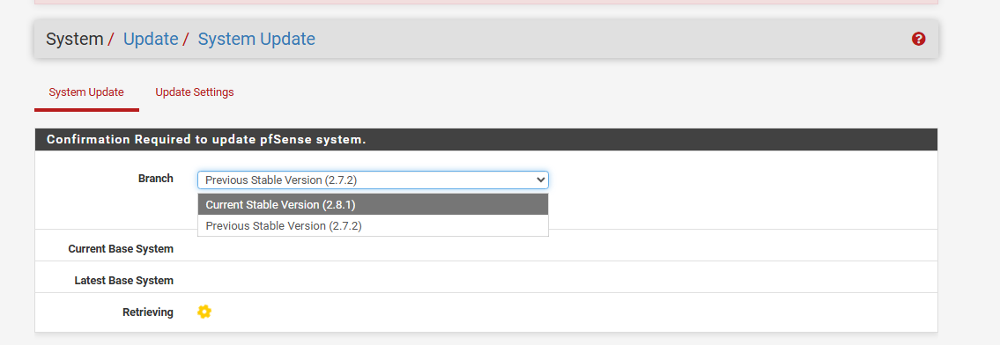

- If you get the error `Unable to check for updates`, follow these steps:

- Select `Diagnostics` -> `Command Prompt`, then paste the following commands into `Execute Shell Command`.

| Step  | Command                                                   |
| ----- | --------------------------------------------------------- |
| **1** | `certctl rehash`                                          |
| **2** | `pkg-static update`                                       |
| **3** | `pkg-static install -fy pkg pfSense-repo pfSense-upgrade` |

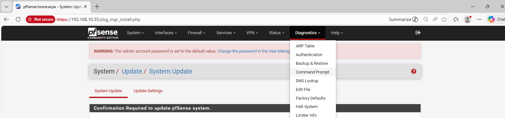

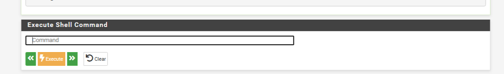

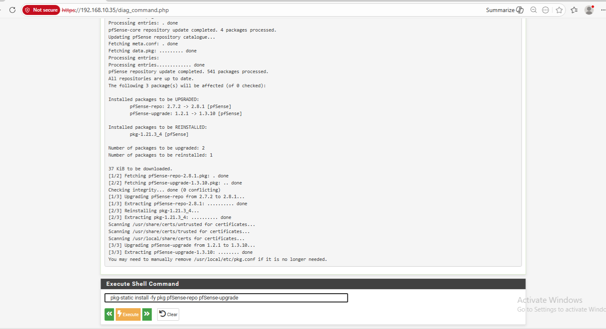

- After running the commands above, go back and continue updating pfSense.
- Click `Confirm` to update pfSense.

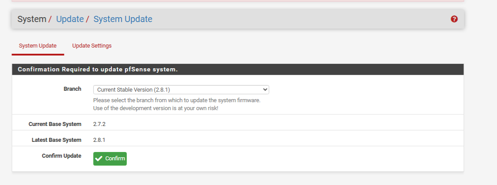

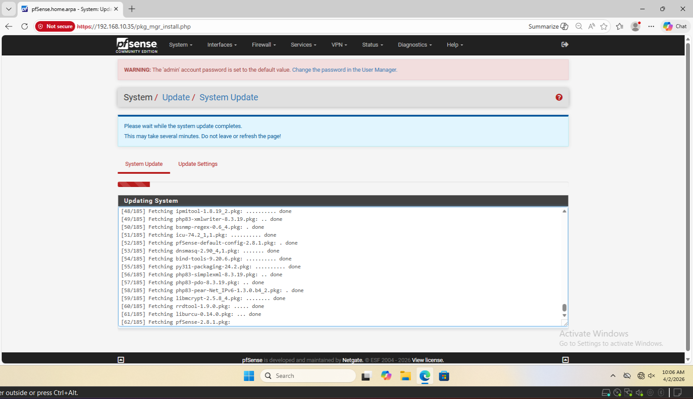

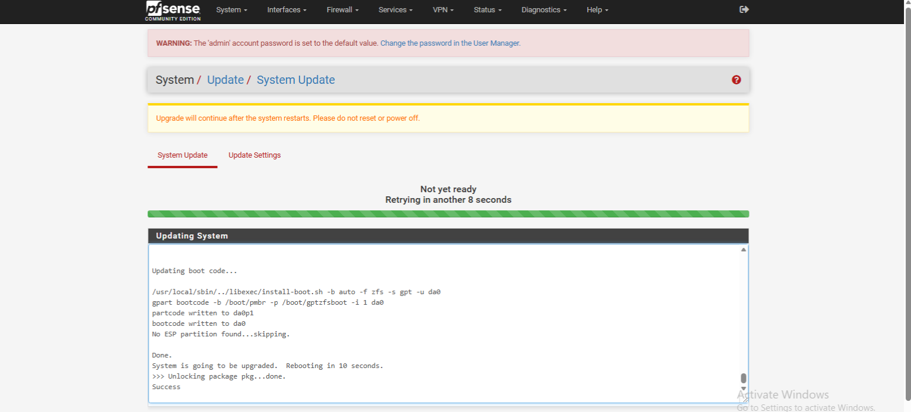

- After the update process completes, pfSense will reboot automatically. After reboot, check pfSense version again to confirm the update was successful.

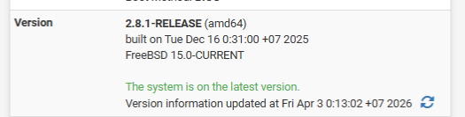

## Set up basic **Firewall Rules** by interface

- If you want to access pfSense from WAN, set a rule as shown below.

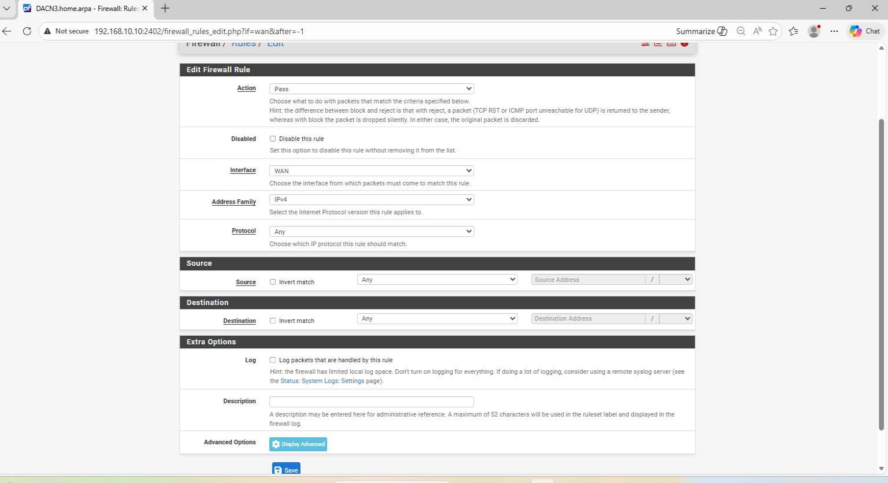

- Click **Add** and fill in settings like this:

| Field              | Configuration Value | Description                                                   |
| ------------------ | ------------------- | ------------------------------------------------------------- |
| **Action**         | `Pass`              | Allow packets matching this rule to pass through the firewall |
| **Interface**      | `WAN`               | Apply rule to incoming traffic from WAN                       |
| **Address Family** | `IPv4`              | Rule applies to IPv4 addresses                                |
| **Protocol**       | `Any`               | Apply to all protocols (TCP, UDP, ICMP, ...)                  |
| **Source**         | `Any`               | Accept packets from any source address                        |
| **Destination**    | `Any`               | Allow traffic to any destination                              |

- After configuring as above, click **Save** and test accessing **pfSense** from the **WAN** interface.

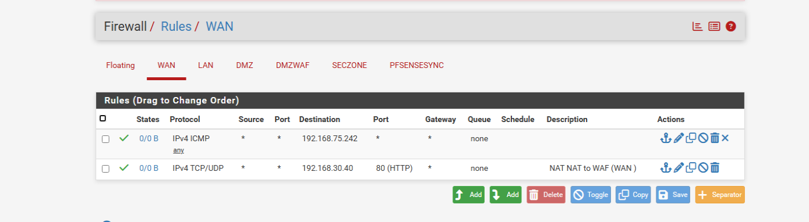

- **In this lab, WAN access to pfSense is not enabled, so this rule is not configured.**

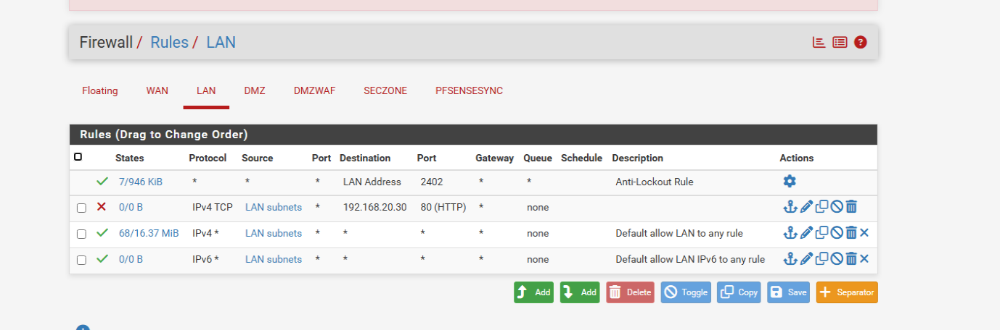

- Create LAN rules as follows:

| No. | Status | Protocol   | Source        | Source Port | Destination     | Dest Port   | Meaning                                                                |
| --- | ------ | ---------- | ------------- | ----------- | --------------- | ----------- | ---------------------------------------------------------------------- |
| 1   | Allow  | `*`        | `*`           | `*`         | `LAN Address`   | `2402`      | Allow access to pfSense management port to avoid locking yourself out  |
| 2   | Block  | `IPv4 TCP` | `LAN subnets` | `*`         | `192.168.20.30` | `80 (HTTP)` | Block LAN hosts from accessing web server `192.168.20.30` on port `80` |
| 3   | Allow  | `IPv4 *`   | `LAN subnets` | `*`         | `*`             | `*`         | Allow all LAN hosts to access anywhere                                 |
| 4   | Allow  | `IPv6 *`   | `LAN subnets` | `*`         | `*`             | `*`         | Allow all access over IPv6                                             |

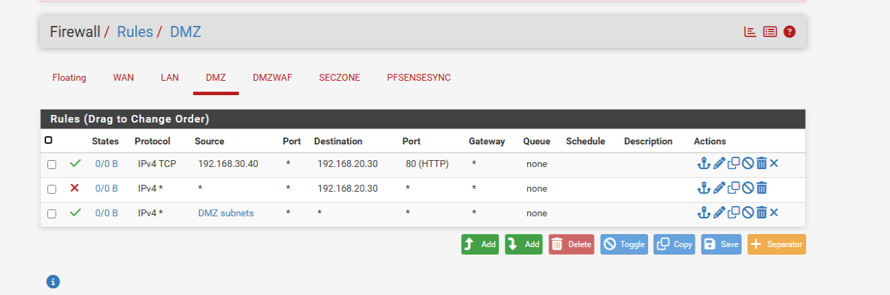

- Create DMZ rules as follows:

| No. | Status | Protocol | Source          | Source Port | Destination     | Dest Port   | Action | Meaning                                               |
| --- | ------ | -------- | --------------- | ----------- | --------------- | ----------- | ------ | ----------------------------------------------------- |
| 1   | Allow  | IPv4 TCP | `192.168.30.40` | `*`         | `192.168.20.30` | `80 (HTTP)` | Pass   | Allow specific WAF/host to access Web Server in DMZ   |
| 2   | Block  | IPv4 \*  | `*`             | `*`         | `192.168.20.30` | `*`         | Block  | Block all other access to Web Server                  |
| 3   | Allow  | IPv4 \*  | `DMZ subnets`   | `*`         | `*`             | `*`         | Pass   | Allow machines in DMZ to access outbound destinations |

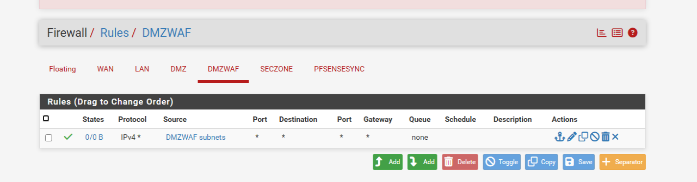

- Create DMZWAF rules as follows:

| No. | Status | Protocol | Source           | Destination | Action | Meaning                                     |
| --- | ------ | -------- | ---------------- | ----------- | ------ | ------------------------------------------- |
| 1   | Allow  | IPv4 \*  | `DMZWAF subnets` | `*`         | Pass   | Allow full WAF subnet access to other zones |

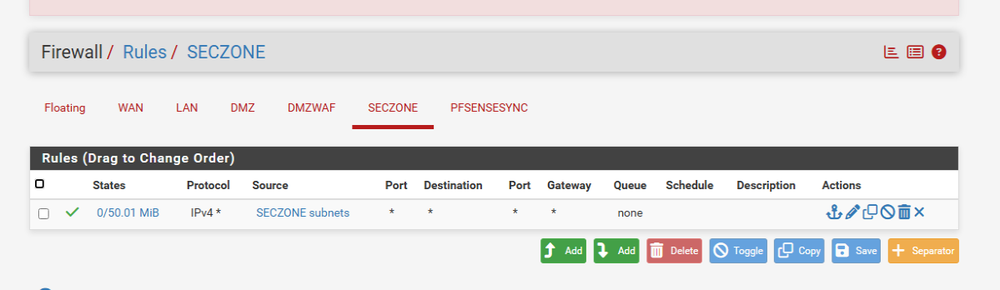

- This part will be redone with other rules later; not completed yet.

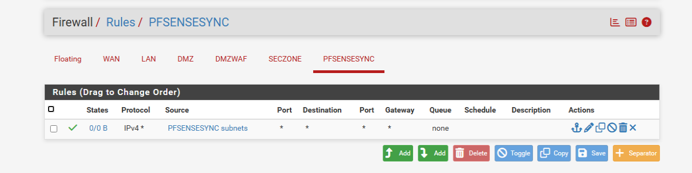

- Create PFSENSESYNC rules as follows:

| No. | Status | Protocol | Source                | Destination | Action | Meaning                             |
| --- | ------ | -------- | --------------------- | ----------- | ------ | ----------------------------------- |
| 1   | Allow  | IPv4 \*  | `PFSENSESYNC subnets` | `*`         | Pass   | Allow HA sync between two firewalls |

## NAT / Port Forward for Web Server services

- Go to **Firewall** -> **NAT** -> **Port Forward**, click **Add**, and configure as below.

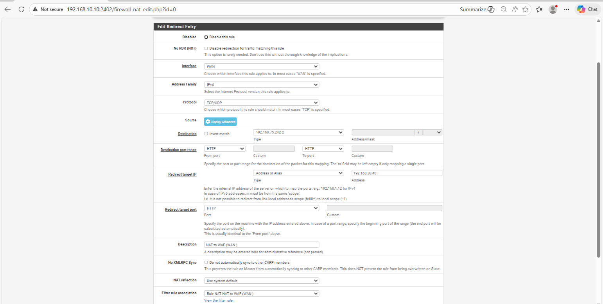

| Field                       | Value              | Description                             |
| --------------------------- | ------------------ | --------------------------------------- |
| **Interface**               | `WAN`              | Applies to inbound traffic from outside |
| **Address Family**          | `IPv4`             | Apply to IPv4 only                      |
| **Protocol**                | `TCP/UDP`          | Allow both TCP and UDP                  |
| **Source**                  | `Any`              | Accept from any source IP               |
| **Destination**             | `192.168.75.242`   | Public WAN/VIP receiving requests       |
| **Destination Port**        | `80 (HTTP)`        | Web service port                        |
| **Redirect Target IP**      | `192.168.30.40`    | Internal WAF machine IP                 |
| **Redirect Target Port**    | `80 (HTTP)`        | Forward to WAF HTTP port                |
| **Description**             | `NAT to WAF (WAN)` | Rule description                        |
| **Filter Rule Association** | `Rule NAT to WAF`  | Auto-create corresponding firewall rule |

- Note: In NAT Port Forward configuration, address `192.168.75.242` is used instead of physical WAN IP such as `192.168.75.131` because this is an HA Firewall model with 1 Master and 1 Backup. Address `192.168.75.242` is the **CARP VIP** (Virtual IP), acting as the representative address for the whole firewall cluster. Under normal conditions, the VIP is assigned to the Master Firewall to process traffic. If the Master fails or stops, the Backup Firewall automatically takes over the VIP and continues handling connections without service interruption. Therefore, NAT rules and external access should always point to the **CARP VIP** instead of each firewall's physical IP, to ensure failover capability and high availability. (See **High Availability (HA)** section for CARP VIP explanation.)

# High Availability (HA)

- Configure **pfSense HA** with CARP VIP to ensure firewall failover
- Backup and failover for critical servers
- Verify service availability during failure scenarios

# Deploy System Components

## Deploy Web Server (DMZ-WEB)

- Configure static IP for **Ubuntu Web Server (192.168.20.30)**
- Install **Docker / Docker Compose**
- Run **DVWA** container to simulate a vulnerable web application
- Verify internal HTTP/HTTPS service availability

## Deploy WAF (DMZ)

- Configure **WAF (192.168.30.40)** in DMZ zone
- Configure filtering rules for **SQL Injection, XSS, LFI/RFI**
- Forward traffic from WAN to Web Server through WAF

## Deploy IDS Monitoring

- Configure **IDS Server (192.168.40.50)**
- Collect logs and detect network attacks
- Monitor traffic from DMZ and Security Zone

## Integrate ELK Logging

- Send logs from **pfSense, WAF, Web Server, IDS** to **ELK Server (192.168.40.60)**
- Verify dashboard, alerts, and event timeline

## Access and Monitoring Validation

- Validate access from **LAN / DMZ / WAN**
- Simulate DVWA attacks and verify logs appear in ELK
- Cross-check alerts between IPS, IDS, and WAF

# SOC Deployment

- Install SOC tools (ELK, Wazuh, Graylog...)
- Collect logs from pfSense, WAF, Web Server, Database, IDS
- Configure dashboards and alerts based on security rules
- Monitor network status and incidents in real time

# IPS / IDS Installation

## Configure IPS to detect and block intrusions

- First, go to **System** -> **Package Manager** to download and install **Suricata**.

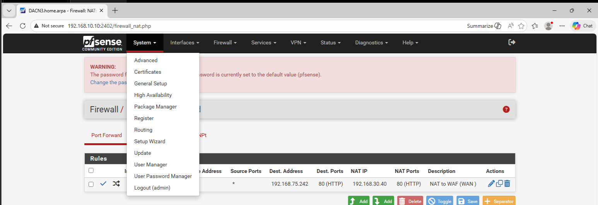

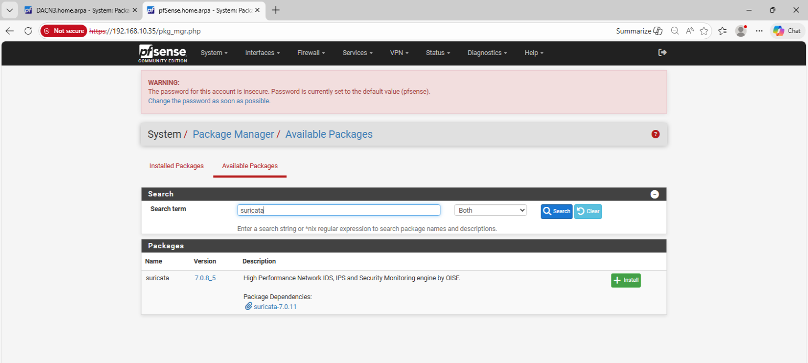

- After **Suricata** is installed, go to **Services** -> **Suricata**, click **ADD**, and configure with settings similar to below.

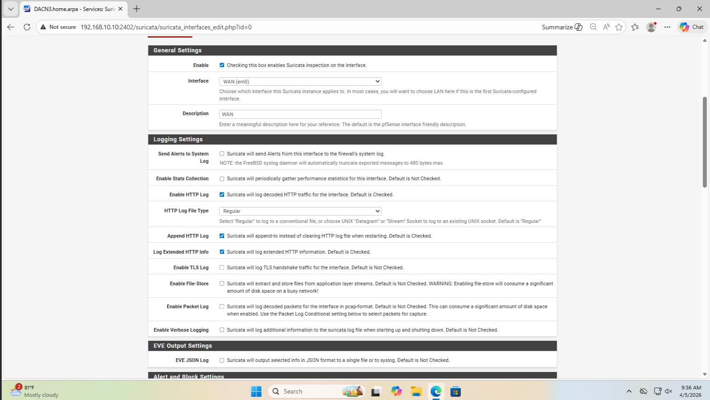

| Configuration Group  | Field                      | Value                   | Meaning                                     |
| -------------------- | -------------------------- | ----------------------- | ------------------------------------------- |
| **General Settings** | Enable                     | `Checked`               | Enable Suricata on the interface            |
|                      | Interface                  | `WAN (em0)`             | Monitor inbound traffic from the Internet   |
|                      | Description                | `WAN`                   | Instance description                        |
| **Logging Settings** | Send Alerts to System Log  | `Checked`               | Send alerts to pfSense system log           |
|                      | Enable Stats Collection    | `Unchecked`             | Do not collect periodic performance stats   |
|                      | Enable HTTP Log            | `Checked`               | Log decoded HTTP traffic                    |
|                      | HTTP Log File Type         | `Regular`               | Write logs to standard file format          |
|                      | Append HTTP Log            | `Checked`               | Append logs after restart                   |
|                      | Log Extended HTTP Info     | `Checked`               | Log detailed HTTP header / method / URI     |
|                      | Enable TLS Log             | `Unchecked`             | Do not log TLS handshake                    |
|                      | Enable File-Store          | `Unchecked`             | Do not extract files from traffic           |
|                      | Enable Packet Log          | `Unchecked`             | Do not store pcap packet logs               |
|                      | Enable Verbose Logging     | `Unchecked`             | Do not write verbose startup logs           |
| **EVE Output**       | EVE JSON Log               | `Unchecked`             | Do not export JSON logs                     |
| **Alert & Block**    | Block Offenders            | `Checked/As configured` | Automatically block IPs that trigger alerts |
| **Performance**      | Run Mode                   | `AutoFP`                | Multi-thread mode, optimized for IDS        |
|                      | AutoFP Scheduler           | `Hash`                  | Thread scheduling by flow hash              |
|                      | Max Pending Packets        | `1024`                  | Maximum number of queued packets            |
|                      | Detect Engine Profile      | `Medium`                | Balance between performance and RAM         |
|                      | MPM Algorithm              | `Auto`                  | Auto-select best multi-pattern matcher      |
|                      | SPM Algorithm              | `Auto`                  | Auto-select single-pattern matcher          |
|                      | Inspection Recursion Limit | `3000`                  | Recursion limit during inspection           |
|                      | Promiscuous Mode           | `Checked`               | Capture all traffic on the interface        |
|                      | PCAP Snaplen               | `1518`                  | Maximum packet capture size                 |
| **Networks**         | Home Net                   | `default`               | Internal networks / VIPs to protect         |
|                      | External Net               | `default`               | External Internet networks                  |
| **Filtering**        | Suppression                | `default`               | No custom suppression                       |

- Install Snort or Suricata
- Set up basic rules to detect network intrusions, malware, and exploits
- Integrate with SOC for alerting and centralized logging

# Testing & Evaluation

- Ping test from LAN/DMZ -> WAN
- Access web services from WAN
- Verify SOC / IPS / IDS / WAF alerts
- Evaluate HA failover and service availability

# Under Preparation

> Information and content are being updated, more will be added as soon as possible

